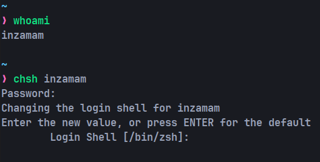

# Terminal-Configurations-with-Oh-My-Zsh

To verify the current SHELL application, you can execute the following command:

```bash
echo $SHELL
```
This command will display the path to the currently active shell on your system.

## Getting Started:

1. **Install Zsh:**
   
    At first, you need to install `zsh` and set it as your main login shell. You can install Z shell using the following command:
    ```bash
    sudo apt install zsh
    ```

2. **Set zsh as Main Login Shell:**

    Once installed, you'll need to set `zsh` as your main login shell. To determine the installation path of `zsh` on your system, use the following command:
    ```bash
    which zsh
        or
    where zsh
    ```


    Then, use the `chsh` command to change your shell:
    ```bash
    chsh <username> #username is optional
    /bin/zsh
    ```

    

    If you have successfully changed the default login shell to Zsh, the output of ``echo $SHELL`` command should be the path to the Zsh shell.

    To create a new `.zshrc` file using the `touch` command and open it in your favorite text editor, you can follow these steps:

    ```bash
    # Create a new .zshrc file
    touch ~/.zshrc

    # Open the file in your favorite text editor
    # For example, if your favorite text editor is nano:
    nano ~/.zshrc
    ```
    Replace `nano` with the name of your preferred text editor (e.g., `vim`, `emacs`, `subl` for Sublime Text, `code` for Visual Studio Code, etc.). This will open the newly created `.zshrc` file in your selected text editor for editing.

    To ensure that this configuration works properly, you need to have Git installed on your system. You can install Git using the following command:
    ```bash
    sudo apt install git
    ```

3. **Install `fzf` (fuzzy finder) plugin:**

    To install the fzf plugin using Git, you can follow these steps:

   + Clone the fzf Repository:

       Open your terminal and run the following command to clone the fzf repository:
       ```bash
       git clone --depth 1 https://github.com/junegunn/fzf.git ~/.fzf

   + Run the Installation Script:

       Change directory to the cloned fzf repository and run the installation script:
       ```bash
       ~/.fzf/install
       ```
       This script will install fzf and add it to your shell configuration file (e.g., .bashrc, .zshrc).

4. **install `zoxide` plugin for better `cd` command**

    ```bash
    curl -sS https://raw.githubusercontent.com/ajeetdsouza/zoxide/main/install.sh | bash
    ```

    This command downloads the installation script from the zoxide GitHub repository and pipes it to the bash shell for execution. The script installs zoxide and sets up the necessary configurations for your shell.

    After running this command, zoxide should be installed and ready to use. You might need to restart your shell or run source ~/.bashrc (or source ~/.zshrc if you're using Zsh) for the changes to take effect.

5. **Paste the Contents:**

    Once your .zshrc file is open, paste the contents you copied from the repository's .zshrc file into it.

